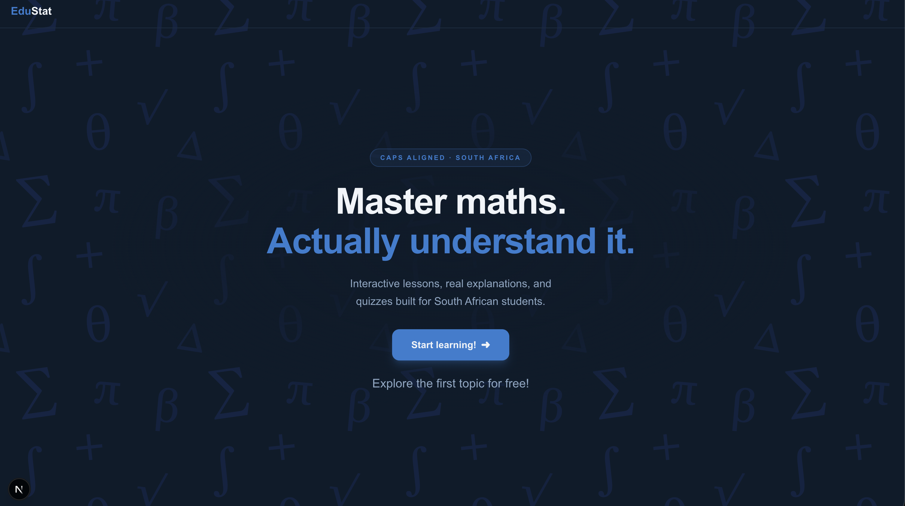
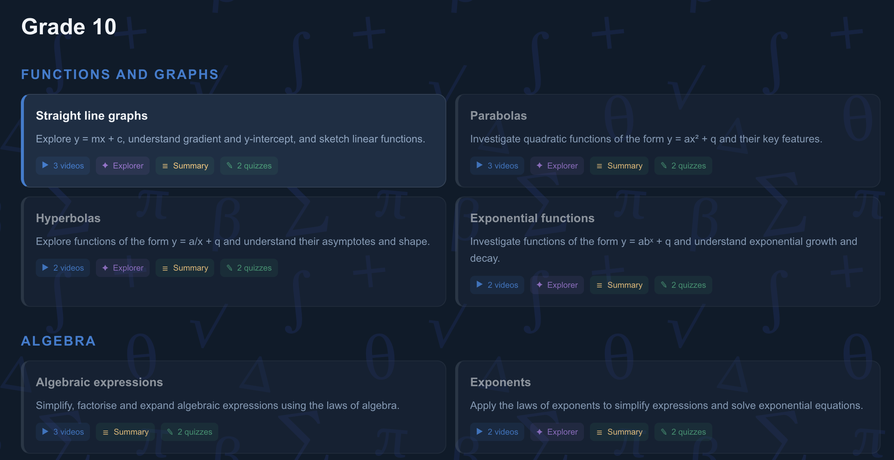
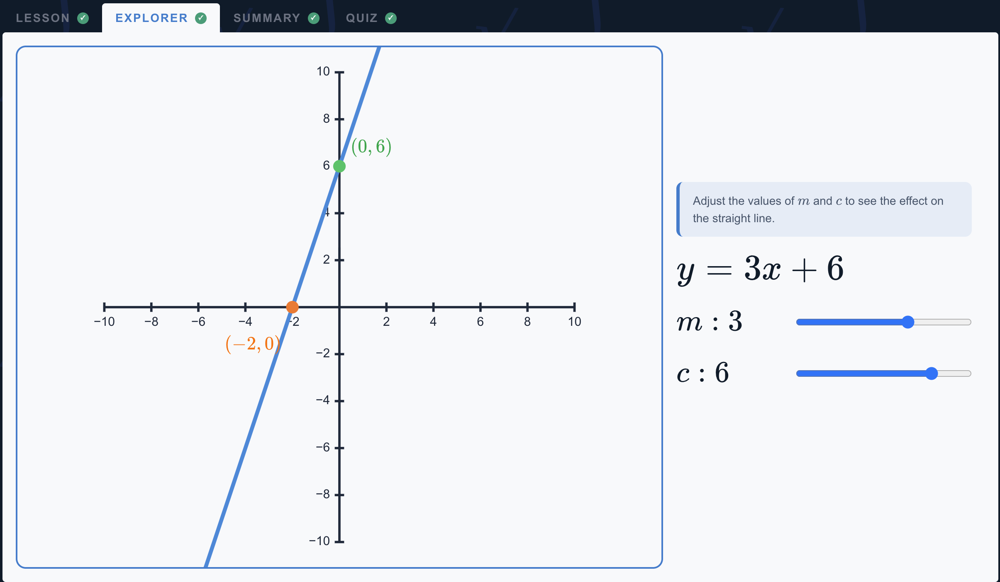

# Education Station

My first web development project 🤙 

Interactive maths lessons for the South African CAPS curriculum, grades 10–12.

**Live:** https://education-station.vercel.app/

Work in progress: **Grade 10 → Straight line graphs** is the topic with the most content (https://education-station.vercel.app/grade-10/straight-line-graphs)

## Stack

- **Next.js 16** (App Router) with **React 19** and **TypeScript**
- **Tailwind CSS v4** for styling
- **KaTeX** for mathematical notation
- **Python / Manim** for the video generation - [animation-station](https://github.com/devenishjenna/animation-station)
- Deployed on **Vercel**, with automatic deploys from `main`

## Topic layout

Every topic lives at `/[grade]/[topic]` and has four tabs:

| Tab | What it is |
|---|---|
| **Lesson** | A short animated video, generated with [Manim](https://github.com/devenishjenna/animation-station) |
| **Explorer** | An interactive SVG graph - drag sliders, watch the maths update, encouraging interactive learning |
| **Summary** | The key rules |
| **Quiz** | Multiple choice with explanations |

